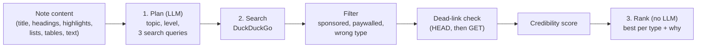

# kanso-ai

The AI service behind [kanso](https://kanso-web-app.vercel.app). Given a note, it recommends one video, one article and one exercise for going deeper on the note's topic. It's a FastAPI service deployed on Fly.io, and it works with OpenAI or Gemini.

| Repository | Role |
|---|---|
| [kanso-frontend](https://github.com/LuisFVillalon/kanso-frontend) | Next.js web app (start here for the full architecture) |
| [kanso-backend](https://github.com/LuisFVillalon/kanso-backend) | Data API: tasks, notes, habits, daily debrief |
| **kanso-ai** (this repo) | Learning-resource recommendations |

## How it works

The LLM plans the search, but it never picks or invents a link. Everything after the plan is deterministic, so every recommendation is a real, reachable page with a stated reason.



1. **Plan** (`planner.py`). The frontend condenses a note into labeled sections, ordered by importance, and the LLM returns a topic, the learner's level, and one search query each for a video, an article and an exercise. The response is constrained with a JSON schema.
2. **Search** (`search.py`, `filters.py`, `credibility.py`). Each query runs on DuckDuckGo (videos restricted to YouTube). Results are dropped if they look sponsored, paywalled, or the wrong kind of resource. Every surviving link is checked for liveness concurrently, then scored on trust signals: institutional domains (`.edu`, `.gov`, universities, libraries), educational title terms, known low-quality domains, clickbait phrasing and thin snippets. Each signal is defined once as data, so the score and its explanation can't drift apart.
3. **Rank** (`ranking.py`). The highest-scoring candidate for each type is chosen and returned with a plain-language explanation of why.

The provider is chosen in `ai_client.py`: OpenAI by default, or Gemini through Google's OpenAI-compatible endpoint, with Gemini's "thinking" disabled so its token budget goes to the JSON answer.

## API

`POST /learning-resources` requires `Authorization: Bearer <supabase-jwt>`.

```json
{
  "title": "Binary search trees",
  "headings": ["Operations", "Why balance matters"],
  "highlights": ["smaller keys", "larger keys"],
  "lists": ["Search / insert: O(h)"],
  "styled_text": [],
  "tables": [],
  "plain_text": "..."
}
```

```json
{
  "topic": "Binary search trees",
  "resources": [
    { "type": "video", "title": "...", "url": "https://www.youtube.com/...", "platform": "YouTube",
      "activity_label": "Watch", "why": "..." }
  ]
}
```

- **Auth:** the service verifies the same Supabase JWT as the main backend (ES256 via the project's JWKS, or HS256 when `SUPABASE_JWT_SECRET` is set), so only signed-in users, including demo sandboxes, can spend LLM credits.
- **Limits:** all fields are optional, and the combined content is capped at 4,000 characters. Each user gets 5 requests per minute and 50 per day (HTTP 429 beyond that).
- `GET /health` is public.

## Running locally

Requires Python 3.12+.

```bash
python -m venv venv
source venv/bin/activate          # Windows: venv\Scripts\activate
pip install -r requirements.txt
# create .env (see below)
uvicorn app.main:app --reload --port 8080   # http://localhost:8080/docs
```

| Variable | Required | Description |
|---|---|---|
| `SUPABASE_URL` | Yes | Supabase project URL, used to fetch the JWKS for token verification |
| `OPENAI_API_KEY` | If using OpenAI | OpenAI API key |
| `GEMINI_API_KEY` | If using Gemini | Gemini API key |
| `AI_PROVIDER` | No | `openai` or `gemini`. Defaults to OpenAI when its key is set, otherwise Gemini. |
| `OPENAI_MODEL` / `GEMINI_MODEL` | No | Model overrides (defaults: `gpt-4.1-mini`, `gemini-2.5-flash`) |
| `SUPABASE_JWT_SECRET` | Only for HS256 projects | Legacy symmetric JWT secret |
| `ALLOWED_ORIGINS` | No | Comma-separated CORS origins (default: `http://localhost:3000,https://kanso-web-app.vercel.app`) |

Linting: `ruff check .` (config in `pyproject.toml`).

## Project structure

```
app/
  main.py                          # App, CORS, /health
  core/auth.py                     # Supabase JWT verification
  core/rate_limit.py               # Per-user sliding-window limits
  api/routes/learning_resources_router.py
  services/learning_resources/     # pipeline.py orchestrates planner → search → ranking
```

## Deployment

`fly deploy`. `SUPABASE_URL` is set in `fly.toml` (it isn't a secret); the LLM keys are Fly secrets (`fly secrets set OPENAI_API_KEY=...`). One machine is kept warm to avoid cold starts.

## Author

Luis Fernando Villalon, San Diego State University. [github.com/LuisFVillalon](https://github.com/LuisFVillalon)
